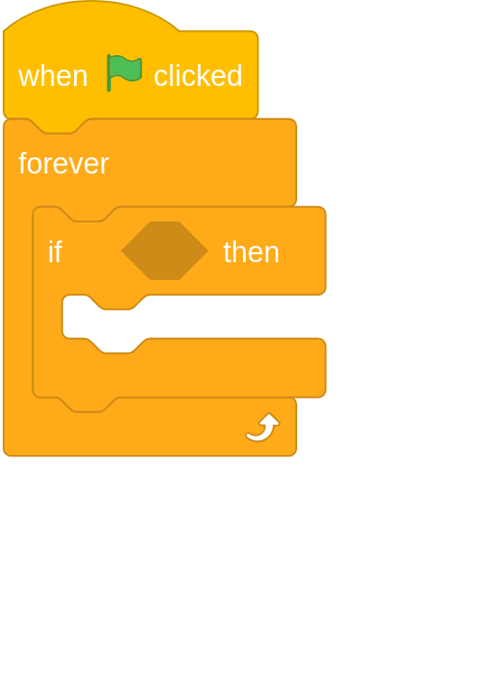

 # micro:bit make a map

# Leader notes

## Overview

This activity fulfills Stage 2, Requirement 2 of the Digital Maker Staged Activity Badge (Create a simple computer program to help with a scouting activity, and try it out) and Stage x, Requirement x of the Give other badge links here. 

Young people will use Scratch along with a micro:bit to draw a map of a wilderness area they have visited or are planning to visit.

## Information 

+ Time - 45 minutes
+ Group size - Flexible (ideally two young people per computer and micro:bit)
+ Preparation needed - If you’re running this activity without access to WiFi, you will need to download the software and starter project ahead of time. You may also wish to print handouts.
+ Location - Wherever you have computer access

## You will need

+ Laptops or desktop computers
+ micro:bits and USB cables
+ Scratch either online or offline
+ Scratch Link Software installed
+ Per group:
  + One laptop or desktop computer
  + One micro:bit
  + One USB A to micro USB B cable
+ Activity handouts

### If your meeting place has Internet Access

Run Scratch online in a web browser with an internet connection using this link rpf.io/scratchon.

Download the Scratch Link software and install the Scrath micro:bit HEX code on the microbits beforehand. Refer to the instructions at rpf.io/scratch-link
### If your meeting place doesn’t have WiFi

Download the Scratch Desktop application beforehand; refere to the Scratch guide rpf.io/scouts-scratch for instructions. 

Download the Scratch Link software and install the Scrath micro:bit HEX code on the microbits beforehand. Refer to the instructions at rpf.io/scratch-link

## Key messages

+ External inputs, such as buttons as sensors can be used with a computer.
+ Infinte loops can be used to detect events and then conditional selection can be used to alter the begabior of a program depending on the event detected.
+ Scratch cab be used as a digital canvas on which images can be drawn.

## Leader instructions
1. Discuss digital arts programs the young people may have used such as Microsoft Paint, and how you might use a mouse or a tablet to draw on a digital canvas.
2. Explain that you can use a variety of input devices to interact with a computer, and that they are going to make a program that will allow them to draw their own maps.
3. If they have not used them before, introduce the young people to the micro:bit. Explain that micro:bits not only have two buttons (for input) but they are also able to sense which way they are tilted.
4. Demonstrate how to connect the micro:bit to the computer and open Scratch (online or offline)
5. With the instructions in the printout, the young people will create code in Scratch allowing them to use their micro:bits to draw a map.
6. Once the project is complete, young people can use their program to create their own custom maps in Scratch, of an campsite environment they have visited.

## Alternatives

+ If micro:bits are not available, this resource can be completes using key presses and the mouse instead.

## Safety

If the young people are working online, tell them to ask for permission before viewing any other websites. It’s a good idea to set up parental controls — you can find instructions for this on the NSPCC website (rpf.io/scouts-nspcc-online).

You should also give each young person a Stay Safe leaflet (rpf.io/scouts-staysafe).

## Adaptability

Here other badge resources primarily cover how you’d adapt this for different educational needs

# Activity / project title

# Handout

You are going to make a computer program using Scratch that will let you use a micro:bit to control your sprite, and then create a digital map of an area you have visited or will be visiting. Tilting the microbit controls where the sprite will move, while the buttons can be used for drawing paths and placing down map icons.

## Did you know

+ Digital maps have led to some very interesting discoveries, such as when an archologist called Angela Micol used Google maps to discover some previously unknow pyraminds in Egypt.

## Instructions

### Part 1: Setting up
1. Open the starter project at rpf.io/scouts-microbit-map-on or if you are offline open the starter project that your leader has provided you.

2. Connect microbit step here - will have to see what happens with starter project.

3. Start by clicking the green flag. The `scouts` sprite should read out the instructions for the map maker program and then shrink down in size.

### Part 2: Moving the scout
You are going to write some code that will control the direction the scout sprite moves, depending on the direction the micro:bit is tilted.

1. Add a  block to the program.
2. The program needs to be able to detect any movement of the micro:bit. To do this, it needs always be listening for events. Add a  loop beneath the  block.

3. With
## Discuss

A question related to the activity which they can discuss in a small group.

## Tip

Any tips which may help the Scouts engage or get more from the activity.

## Sharing

How the output or ideas from the activity might be shared with others. 
